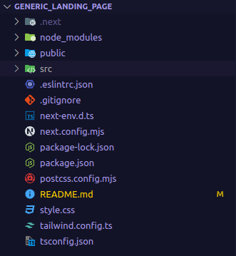

# COFFEE SHOP TIA ROSA

COFFEE SHOP TIA ROSA é dedicado a oferecer os melhores cafés e um ambiente confortável para nossos clientes. Nossa missão é proporcionar uma experiência única, combinando sabores incríveis com um espaço aconchegante. Além disso, oferecemos acesso à internet para que você possa trabalhar ou relaxar enquanto aprecia nossos produtos.

## Getting Started

This is a [Next.js](https://nextjs.org/) project bootstrapped with [`create-next-app`](https://github.com/vercel/next.js/tree/canary/packages/create-next-app).

First, run the development server:

```bash
npm run dev
# or
yarn dev
# or
pnpm dev
# or
bun dev
```

Open [http://localhost:3000](http://localhost:3000) with your browser to see the result.

This project is uploaded to [Vercel](https://vercel.com/) and can be accessed at [https://generic-landing-page-swart.vercel.app/](https://generic-landing-page-swart.vercel.app/). (If it wasn't taken down yet)

## Creating the COFFEE SHOP TIA ROSA Website

In this section, we will walk through the steps to create the COFFEE SHOP TIA ROSA website using Next.js.

### Step 1: Setting Up the Project

First, create a new Next.js project using the create-next-app command:

```bash
npx create-next-app@latest coffee-shops-tia-rosa
cd coffee-shops-tia-rosa
```

## Step 2: Project Structure

After setting up, your project structure should look similar to this:



## Step 3: Creating the Landing Page


We will start by creating the landing page for our site. Open `src/app/page.tsx` and update it with the following code:

```
import Head from 'next/head';
import Image from 'next/image';
import styles from '../styles/Home.module.css';

export default function Home() {
  return (
    <div className={styles.container}>
      <Head>
        <title>COFFEE SHOPS TIA ROSA</title>
        <meta name="description" content="O melhor café e acesso à internet" />
        <link rel="icon" href="/favicon.ico" />
      </Head>

      <header className={styles.header}>
        <h1>COFFEE SHOPS TIA ROSA</h1>
        <nav>
          <ul>
            <li><a href="#about">Sobre Nós</a></li>
            <li><a href="#products">Produtos</a></li>
            <li><a href="#contact">Contato</a></li>
          </ul>
        </nav>
      </header>

      <section id="hero" className={styles.hero}>
        <h2>O melhor café e acesso à internet</h2>
        <p>Desfrute do nosso ambiente acolhedor e dos nossos deliciosos produtos</p>
      </section>

      <section id="about" className={styles.about}>
        <h2>Sobre Nós</h2>
        <p>O COFFEE SHOPS TIA ROSA é dedicado a oferecer os melhores cafés e um ambiente confortável para nossos clientes. Nossa missão é proporcionar uma experiência única, combinando sabores incríveis com um espaço aconchegante.</p>
      </section>

      <section id="products" className={styles.products}>
        <h2>Produtos</h2>
        <div className={styles.productList}>
          <div className={styles.product}>
            <h3>Café Expresso</h3>
            <p>A nossa especialidade, feito com os melhores grãos.</p>
          </div>
          <div className={styles.product}>
            <h3>Cappuccino</h3>
            <p>Uma combinação perfeita de café, leite e espuma.</p>
          </div>
          <div className={styles.product}>
            <h3>Smoothie de Frutas</h3>
            <p>Refrescante e saudável, perfeito para qualquer hora do dia.</p>
          </div>
        </div>
      </section>

      <section id="contact" className={styles.contact}>
        <h2>Contato</h2>
        <p>Para mais informações, entre em contato conosco:</p>
        <p>Email: contato@tia-rosa.com</p>
        <p>Telefone: (11) 1234-5678</p>
      </section>

      <footer className={styles.footer}>
        <p>&copy; 2024 COFFEE SHOPS TIA ROSA. Todos os direitos reservados.</p>
      </footer>
    </div>
  );
}
```

## Step 4: Styling the Landing Page

Create a new CSS file styles/Home.module.css or use globals.css (not recommended) and add the following styles:

```
.container {
  font-family: Arial, sans-serif;
  margin: 0;
  padding: 0;
  background-color: #f8f8f8;
  color: #333;
}

.header {
  background-color: #4CAF50;
  color: white;
  padding: 15px 0;
  text-align: center;
}

.header h1 {
  margin: 0;
}

.header nav ul {
  list-style: none;
  padding: 0;
}

.header nav ul li {
  display: inline;
  margin: 0 10px;
}

.header nav ul li a {
  color: white;
  text-decoration: none;
}

.hero {
  background: url('https://via.placeholder.com/1500x500') no-repeat center center;
  background-size: cover;
  color: white;
  text-align: center;
  padding: 100px 0;
}

.hero h2 {
  font-size: 2.5em;
  margin: 0;
}

.hero p {
  font-size: 1.2em;
}

.about,
.products,
.contact {
  margin: 40px 0;
  padding: 20px;
}

.about h2,
.products h2,
.contact h2 {
  border-bottom: 2px solid #4CAF50;
  padding-bottom: 10px;
  margin-bottom: 20px;
}

.productList {
  display: flex;
  justify-content: space-around;
  flex-wrap: wrap;
}

.product {
  background: white;
  padding: 20px;
  margin: 10px;
  border-radius: 5px;
  box-shadow: 0 0 10px rgba(0,0,0,0.1);
  flex: 1 1 30%;
  text-align: center;
}

.footer {
  background-color: #333;
  color: white;
  text-align: center;
  padding: 10px 0;
}
```

## Step 5: Running the Project

Now, you can run the project and see the result in your browser:

```bash
npm run dev
# or
yarn dev
# or
pnpm dev
# or
bun dev
```

Open http://localhost:3000 to see the landing page for COFFEE SHOPS TIA ROSA.

Feel free to customize and expand the content and styles to better fit the needs of COFFEE SHOP TIA ROSA.
